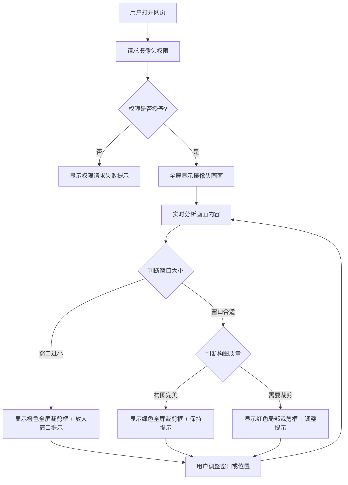

## 1. 产品概述

最佳拍摄视角推荐工具，通过实时分析摄像头画面，智能推荐最佳拍摄构图和裁剪区域，指导用户通过调整设备位置或缩放窗口来获得理想的拍摄效果。

- 主要用途：帮助用户快速找到最佳拍摄角度和构图，适用于拍照、视频录制等场景
- 目标用户：摄影爱好者、内容创作者、普通手机用户
- 产品价值：降低构图门槛，提升拍摄质量，提供即时视觉反馈

## 2. 核心功能

### 2.1 用户角色

| 角色 | 注册方式 | 核心权限 |
|------|----------|----------|
| 普通用户 | 无需注册 | 使用全部功能，实时查看摄像头画面和裁剪推荐 |

### 2.2 功能模块

1. **主页面**：全屏摄像头画面展示、实时裁剪框叠加、状态提示

### 2.3 页面详情

| 页面名称 | 模块名称 | 功能描述 |
|----------|----------|----------|
| 主页面 | 摄像头画面模块 | 全屏展示实时摄像头采集画面，自适应窗口大小 |
| 主页面 | 画面分析模块 | 实时分析画面内容，检测构图、主体位置、画面比例 |
| 主页面 | 裁剪框叠加模块 | 根据分析结果显示不同颜色的推荐裁剪框（橙色/绿色/红色） |
| 主页面 | 窗口检测模块 | 检测浏览器窗口大小，过小的话给出提示 |
| 主页面 | 状态提示模块 | 显示当前拍摄建议和操作指引 |

## 3. 核心流程

用户打开网页 → 请求摄像头权限 → 全屏显示实时画面 → 实时分析画面内容 → 根据分析结果显示对应颜色的裁剪框 → 提示用户调整窗口大小或移动位置 → 用户根据指导获得最佳拍摄视角

## 4. 用户界面设计

### 4.1 设计风格

- 主色调：深色背景（#0a0a0a），突出摄像头画面
- 裁剪框颜色：
  - 橙色（#FF6B35）：窗口过小警告
  - 绿色（#00D26A）：构图完美
  - 红色（#FF3366）：需要裁剪调整
- 字体：现代无衬线字体，清晰易读
- 布局：沉浸式全屏，最小化UI元素干扰
- 动效：裁剪框边缘呼吸灯效果，平滑过渡动画

### 4.2 页面设计概述

| 页面名称 | 模块名称 | UI元素 |
|----------|----------|--------|
| 主页面 | 摄像头画面 | 全屏video元素，居中显示，保持画面比例 |
| 主页面 | 裁剪框叠加 | Canvas层，动态绘制矩形边框，边角加粗设计 |
| 主页面 | 状态提示 | 半透明圆角卡片，显示当前状态和操作建议 |
| 主页面 | 窗口大小指示器 | 右上角小型状态指示器，实时显示窗口尺寸 |

### 4.3 响应式

- 桌面端优先设计，自适应各种屏幕尺寸
- 移动端优化触摸操作，支持横屏竖屏切换
- 裁剪框坐标基于百分比计算，确保在不同分辨率下比例一致

### 4.4 交互细节

- 裁剪框边框粗细：4px，边角处8px加粗设计
- 状态提示卡片：半透明背景（rgba(0,0,0,0.7)），白色文字
- 动画：状态切换时0.3秒平滑过渡，裁剪框呼吸效果
