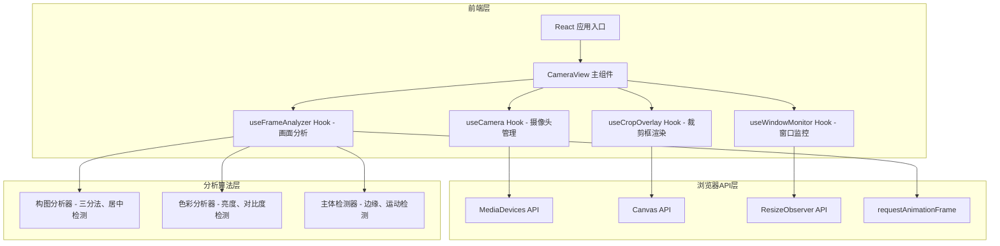

## 1. 架构设计



## 2. 技术描述

- 前端框架：React@18 + TypeScript + Vite
- 样式方案：TailwindCSS@3
- 状态管理：Zustand
- 图标库：lucide-react
- 初始化工具：vite-init
- 后端：无（纯前端应用）
- 数据库：无

**核心技术选型说明：**
1. **MediaDevices API**：访问用户摄像头，获取实时视频流
2. **Canvas API**：用于画面像素分析和裁剪框绘制
3. **ResizeObserver**：监听窗口大小变化
4. **requestAnimationFrame**：实现流畅的实时分析和渲染循环
5. **像素级图像分析**：通过Canvas获取图像数据，进行亮度、对比度、边缘检测

## 3. 目录结构

```
src/
├── components/
│   ├── CameraView.tsx          # 主摄像头视图组件
│   ├── CropOverlay.tsx         # 裁剪框叠加层组件
│   ├── StatusCard.tsx          # 状态提示卡片
│   └── WindowIndicator.tsx     # 窗口大小指示器
├── hooks/
│   ├── useCamera.ts            # 摄像头访问Hook
│   ├── useFrameAnalyzer.ts     # 画面分析Hook
│   ├── useCropOverlay.ts       # 裁剪框渲染Hook
│   └── useWindowMonitor.ts     # 窗口监控Hook
├── utils/
│   ├── analyzer.ts             # 画面分析算法
│   ├── cropCalculator.ts       # 裁剪框计算逻辑
│   └── types.ts                # 类型定义
├── store/
│   └── useCameraStore.ts       # 全局状态管理
├── App.tsx                     # 应用入口
├── main.tsx                    # React入口
└── index.css                   # 全局样式
```

## 4. 核心类型定义

```typescript
// 裁剪框状态类型
export type CropStatus = 'too_small' | 'perfect' | 'needs_crop';

// 裁剪框配置
export interface CropBox {
  x: number;           // 左上角X坐标（百分比 0-100）
  y: number;           // 左上角Y坐标（百分比 0-100）
  width: number;       // 宽度（百分比 0-100）
  height: number;      // 高度（百分比 0-100）
  status: CropStatus;
  color: string;
}

// 画面分析结果
export interface FrameAnalysis {
  brightness: number;       // 平均亮度 0-255
  contrast: number;         // 对比度 0-100
  subjectPosition: {        // 主体位置
    x: number;
    y: number;
    confidence: number;
  };
  compositionScore: number; // 构图得分 0-100
  ruleOfThirds: boolean;    // 是否符合三分法
}

// 应用状态
export interface CameraState {
  isStreaming: boolean;
  stream: MediaStream | null;
  error: string | null;
  currentCrop: CropBox | null;
  analysis: FrameAnalysis | null;
  windowSize: { width: number; height: number };
  suggestion: string;
}
```

## 5. 核心算法设计

### 5.1 窗口大小检测算法

- 最小窗口阈值：宽度 >= 800px，高度 >= 600px
- 小于阈值：状态 = too_small，橙色全屏裁剪框
- 大于等于阈值：进入画面分析流程

### 5.2 画面分析算法

1. **亮度检测**：计算所有像素的平均亮度
   - 理想范围：80-180
   - 过暗(<80)或过亮(>180)：降低构图得分

2. **对比度检测**：计算像素亮度标准差
   - 理想范围：40-80
   - 对比度太低：画面平淡，建议调整

3. **三分法构图检测**：
   - 将画面分为3x3网格
   - 检测主体是否位于网格线交点附近
   - 主体靠近交点：构图得分高

4. **主体检测**：
   - 使用边缘检测（Sobel算子简化版）
   - 检测画面中变化最剧烈的区域
   - 确定主体位置和置信度

### 5.3 裁剪框计算逻辑

| 条件 | 状态 | 颜色 | 裁剪框 |
|------|------|------|--------|
| 窗口 < 800x600 | too_small | #FF6B35 (橙色) | 全屏 (0,0,100,100) |
| 构图得分 >= 80 且 主体居中 | perfect | #00D26A (绿色) | 全屏 (0,0,100,100) |
| 构图得分 < 80 或 主体偏移 | needs_crop | #FF3366 (红色) | 根据主体位置计算最佳裁剪区域 |

### 5.4 实时分析性能优化

- 分析频率：每500ms执行一次（2fps），平衡性能和实时性
- 画面降采样：将视频帧缩小到160x120进行分析，大幅提升性能
- requestAnimationFrame调度：确保UI渲染流畅
- WebWorker可选：复杂分析可移至Worker线程

## 6. 状态管理

使用 Zustand 管理全局状态：

```typescript
import { create } from 'zustand';
import { CameraState, CropBox, FrameAnalysis } from '@/utils/types';

export const useCameraStore = create<CameraState>((set) => ({
  isStreaming: false,
  stream: null,
  error: null,
  currentCrop: null,
  analysis: null,
  windowSize: { width: window.innerWidth, height: window.innerHeight },
  suggestion: '',
  
  setStream: (stream) => set({ stream, isStreaming: !!stream }),
  setError: (error) => set({ error }),
  setCrop: (crop) => set({ currentCrop: crop }),
  setAnalysis: (analysis) => set({ analysis }),
  setWindowSize: (size) => set({ windowSize: size }),
  setSuggestion: (suggestion) => set({ suggestion }),
}));
```
